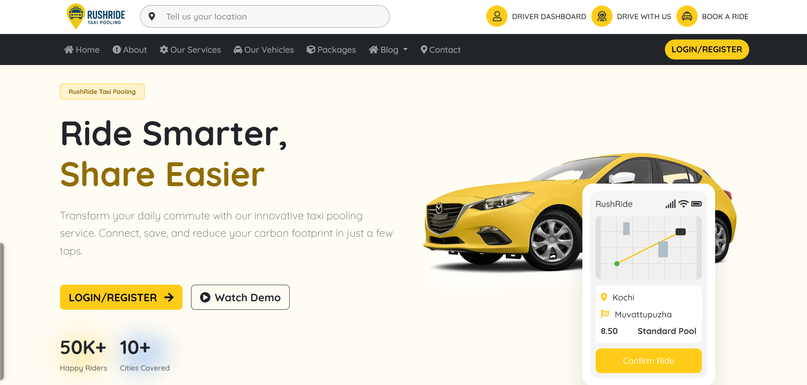
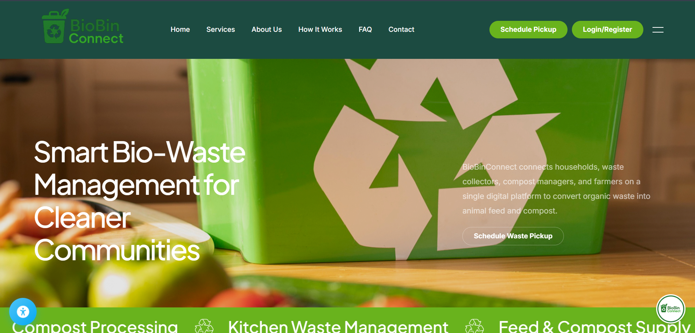
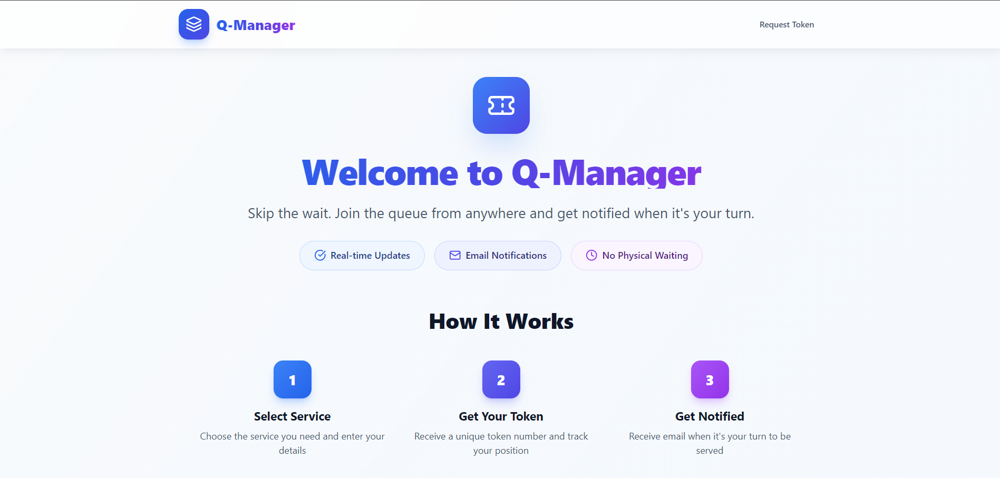
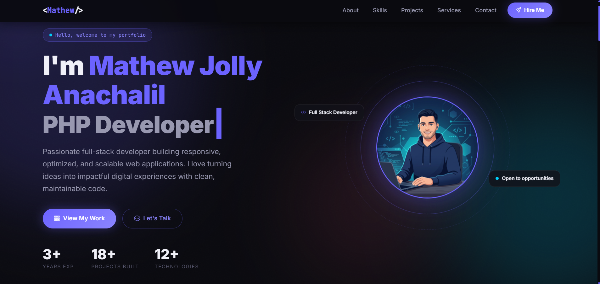

<!-- Hero Section -->

  
  
  <h2><a href="https://mathewjolly.vercel.app" target="_blank" rel="noopener noreferrer">mathewjolly.vercel.app</a></h2>
  
  

    <strong>Architecting scalable, robust, and user-centric web applications.</strong> 
    Bridging the gap between complex backend logic and seamless frontend experiences.
  

  
  

    
    
    
    
  

 

  

 
 

## 🛠 Technology Stack

A curated selection of my core tools and technologies, chosen for performance, scalability, and ecosystem robustness.

| Frontend & UI Ecosystem | Backend & Database Systems |
| :---: | :---: |
|    |    |

 
 

## 🚀 Featured Products

Here are some of the key platforms I've engineered. My work focuses on scalable architecture, clean codebases, and practical problem-solving.

### 1️⃣ RushRide – Taxi Pooling System
> A comprehensive ride-sharing platform optimizing travel routes and managing bookings in real-time.

*   **Role & Impact:** Engineered the core routing logic, built a responsive user interface for bookings, and developed an administrative dashboard for drivers to manage trips efficiently.
*   **Tech Stack:** `PHP` `MySQL` `JavaScript` `HTML` `CSS`
*   **Key Features:** Real-time route management, secure user authentication, distinct rider and driver flows.

  

---

### 2️⃣ BioBin Connect – Waste Management Platform
> A multi-stakeholder sustainability platform bridging households, waste collectors, and administrative bodies.

*   **Role & Impact:** Designed a resilient backend architecture to handle data tracking across different user roles, promoting organized and automated waste collection workflows.
*   **Tech Stack:** `Python` `Django`
*   **Key Features:** Robust multi-tenant architecture, status tracking flows, comprehensive interactive dashboards.

  

---

### 3️⃣ Queue Manager – Smart Queueing
> A digital waitlist and queue management system designed to reduce churn and wait times in service environments.

*   **Role & Impact:** Built a reactive JavaScript interface to digitize queue statuses and streamline user entry management.
*   **Tech Stack:** `React` `Node.js`
*   **Key Features:** Live queue updates, centralized admin management panel, intuitive customer-facing display.

  

---

### 4️⃣ Personal Development Portfolio
> A high-performance, interactive showcase of my technical journey and engineering capabilities.

*   **Link:** [mathewjolly.vercel.app](https://mathewjolly.vercel.app)
*   **Role & Impact:** Complete end-to-end development, focusing on smooth animations, clean typography, and modern UI/UX product design principles.

  

 
 

## 📊 Developer Metrics

  
    
  
  

 
 

## 🧠 Approach & Current Focus

### What I'm building now
- 👨‍💻 Continuously adding features to my primary portfolio: **[mathewjolly.vercel.app](https://mathewjolly.vercel.app)**
- 🔭 Working on scaling personal side projects and transitioning architecture designs.
- 🌱 Diving deeper into Advanced React Patterns and Backend API optimization.

### Engineering Philosophy
> *"Code is read much more often than it is written."*

I treat software development as an architectural craft. I prioritize **maintainable systems**, **self-documenting code**, and a relentless focus on the **end-user experience**. I believe in writing software that isn't just functional, but reliable, secure, and easy for the next developer to pick up and scale.

 
 

## 🤝 Let's Collaborate

I am always open to discussing technical architecture, new product ideas, or opportunities to join an ambitious engineering team.

*   🌐 **Portfolio:** [mathewjolly.vercel.app](https://mathewjolly.vercel.app)
*   💻 **GitHub:** [@mathewjolly11](https://github.com/mathewjolly11)
*   📭 **Email:** [Send me a message](mailto:mathewjolly.dev@gmail.com) 
*   💼 **LinkedIn:** [Mathew Jolly](https://linkedin.com/in/mathewjolly)

 

  Designed & Documented by Mathew Jolly © 2026

